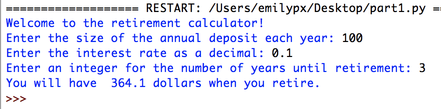

# Problem Set 3

### Due Friday, February 12, 2021, at 11:59pm EST

For this problem set, you will submit to Canvas **a single .zip file**. Detailed instructions for what the .zip file should contain are at the end of this problem set. Note that if you do not submit the files as specified here, there will be a major deduction in your grade for this assignment. Following directions to the letter is a crucial skill for computer programming.

## Getting started

In your `CS1` folder you created for the previous problem set, create a folder called `ps3`. You will put all of the components required for this problem set in the `ps3` folder, which you will then zip up and submit as a `.zip` file to Canvas, just as you did for PS2.

## Part 1
In Part 1, you will build a financial calculator that can be used to calculate the future value of a retirement account. This is an idealized retirement account, where each year the person deposits the same amount of money on January 1, and the same interest rate is applied to the balance on December 31.

For example, suppose you deposit $100.00 per year for three years in a retirement account that earns 10% interest. On January 1 of year 1, you deposit your $100. On December 31, you will earn $10.00 interest (i.e., 10% of $100.00) giving you a balance of $110.00 after 1 year. On January of year 2 you will deposit another $100.00, giving you a balance of $210.00. Then, on December 31 of year 2, you will earn $21.00 interest (i.e., 10% of $210.00) giving you a balance of $231.00 after 2 years. On January 1 of year 3, you again deposit $100.00, giving you $331. On December 31, interest is calculated ($33.10) and added to the current balance ($331), giving you $364.10. 

Your program will be called `part1.py` and will do the following, **without using functions**:

1. Print a message explaining that it is a retirement calculator and will be asking some questions.
2. Prompt the user to enter the size of the annual deposit in dollars.
3. Prompt the user to enter the interest rate **as a decimal** (so 10% would be 0.10).
4. Prompt the user to enter the number of years until retirement **as an integer**.
5. **Using a `for` loop,** calculate the  value of the retirement account when the user retires.
6. Print the  value of the retirement account when the user retires.

You can check your math with this handy calculator, entering 0 for the `Current principal`.

http://www.moneychimp.com/calculator/compound_interest_calculator.htm

Here is a sample run of the program:

Put `part1.py` in your `ps3` folder.

## Part 2
In part 2, you will create a new version of your program from part 1 called `part2.py`, but this time you will rewrite it so that it has **2 functions**: a `main()` function and a function called `calculate()`. 

* The `calculate()` function will take three arguments:

1. The size of the annual deposit.
2. The interest rate.
3. The number of years until retirement.

It will then perform the calculation you carried out in Part 1, but this time, **you will use a `while` loop**. As before you will print ou the value of the account when the user retires. It should give the same result as Part 1, of course.

* The `main()` function will carry out steps 1 through 4 above. It will then call the `calculate()` function with the three values that the user input. 

The output of the program should be identical to that in Part 1.

Put `part2.py` in your `ps3` folder.

## Part 3
* while loop for guessing a number + binary search + random numbers

